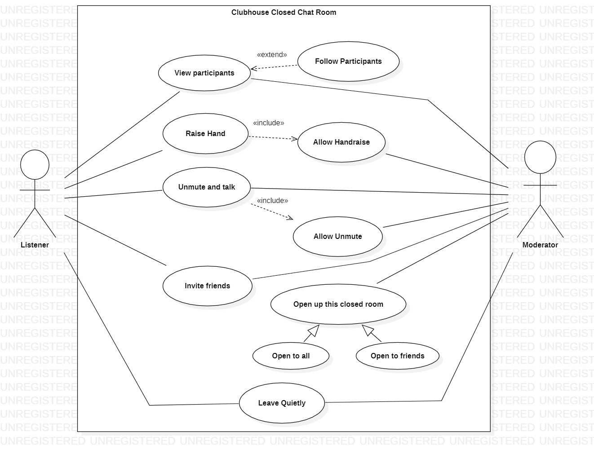

# **Clubhouse Closed Chat Room**

This system is a simple and modified representation of the closed chat room feature of the Clubhouse App. This diagram intends to show what a **Listener** and a **Moderator** can do in this **Clubhouse Closed Chat Room**.

### **Actors Involved**:

- **Listener**:
  This actor represents a user in this closed chat room who has minimal privileges.

- **Moderator**:
  This actor represents a user similar to the _listener_, but has some more privileges as a moderator.

### **Use Cases**:

- **View Participants**:
  Both the actors can view the participants in the room and their details.

- **Follow Participants**:
  Both the actors can follow the participants if they want after viewing the participants.

- **Allow Handraise**:
  Moderator can enable or disable the handraise feature to control if the listener can raise their hand.

- **Raise Hand**:
  Listener can click on "raise hand" feature to request the moderator to enable the unmute feature for him/her. Listener can raise their hand only if the handraise feature is enabled by the moderator.

- **Allow Unmute**:
  Moderator can enable or disable the unmute feature to control if the listener can unmute and speak.

- **Unmute and Talk**:
  Both the listener and moderator can unmute and speak. Listener can unmute themselves only if the unmute feature is enable for him/her by the moderator.

- **Invite Friends**:
  Both the actors can invite their friends to join the room. Invitee from listener can only join if the moderator permits.

- **Open up this private room**:
  Moderator can open up this private room to be more accessible.Room can be opened up either as "open for all" or "open to only friends".

- **Leave Quietly**:
  Both the actors can leave the room quietly. If the only remaining modertor of the room leaves the room, the room is ended for all the participants.

---

\* `This system by no means tries to resemble all the features of the Clubhouse exactly as it is. Only some selected features are included and some features have been modified as per the need.`

---
